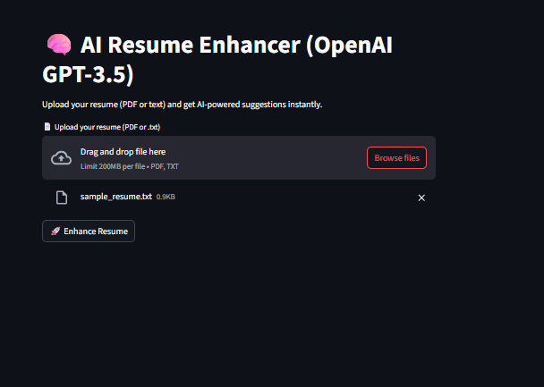
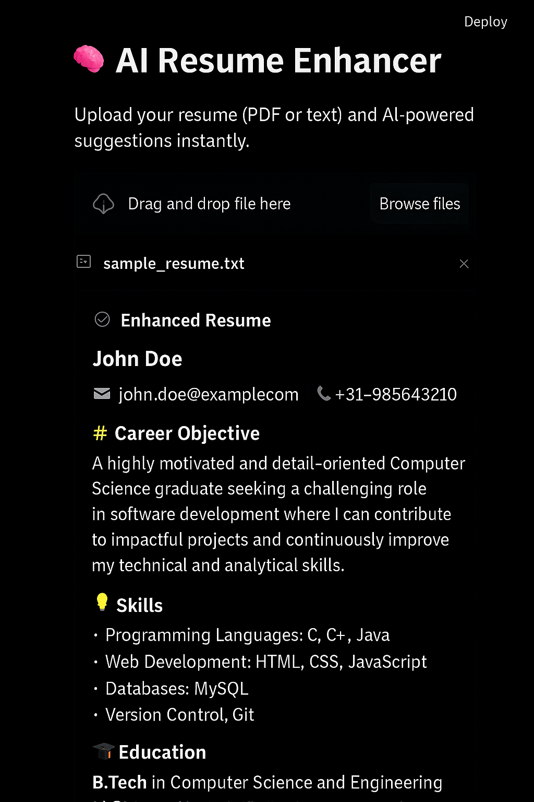

# 🧠 AI Resume Enhancer (OpenAI GPT-3.5)

A simple Streamlit app that enhances resumes using OpenAI GPT-3.5. Upload your PDF or TXT file, and get suggestions to rewrite weak areas, highlight strengths, and improve formatting.

## ✨ Features

- Upload `.pdf` or `.txt` resumes
- Extract text and analyze using GPT-3.5
- AI-enhanced suggestions shown in real-time
- Clean, intuitive Streamlit UI

## ⚙️ Tech Stack

- `Streamlit` – web interface
- `PyPDF2` – for reading PDF files
- `OpenAI` Python SDK v1.x – to call GPT-3.5 API

## 📂 Folder Structure

```
AI_Resume_Enhancer_GitHub/
├── streamlit_app.py
├── requirements.txt
├── README.md
├── .gitignore
├── .streamlit/
│   └── secrets.toml
└── images/
    ├── input_screen.png
    └── output_screen.png
```

## 📥 How to Install & Run

```bash
# Clone this repo
git clone https://github.com/yourusername/AI_Resume_Enhancer_GitHub.git
cd AI_Resume_Enhancer_GitHub

# Install dependencies
pip install -r requirements.txt

# Add your OpenAI API key
# Create a file `.streamlit/secrets.toml` and add:
# OPENAI_API_KEY = "your-openai-key"

# Run the Streamlit app
streamlit run streamlit_app.py
```

## 🔑 Getting the OpenAI API Key

1. Visit [https://platform.openai.com/account/api-keys](https://platform.openai.com/account/api-keys)
2. Login and generate a secret key
3. Copy and paste it into `.streamlit/secrets.toml` like below:

```toml
OPENAI_API_KEY = "your-openai-key"
```

## 🧪 Sample Resume Input

```
John Doe
Email: john@example.com
Phone: +91-9876543210

Objective:
To get a job where I can grow.

Skills:
C, Java, HTML, CSS, MySQL

Experience:
Intern at ABC — developed web pages

Education:
B.Tech, XYZ University, 2023
```

## ✅ Enhanced Resume Output

```
🎯 Objective:
Motivated Computer Science graduate seeking a software development role to apply my skills and grow professionally.

🛠 Skills:
- Languages: C, Java
- Web: HTML, CSS
- Database: MySQL
- Tools: Git

💼 Experience:
Intern at ABC Pvt Ltd
- Developed responsive pages using HTML/CSS
- Collaborated with senior devs and fixed bugs
```

## 📸 Screenshots

### Upload Interface


### Enhanced Result


---

## 🧾 License

This project is licensed under the [MIT License](LICENSE).
